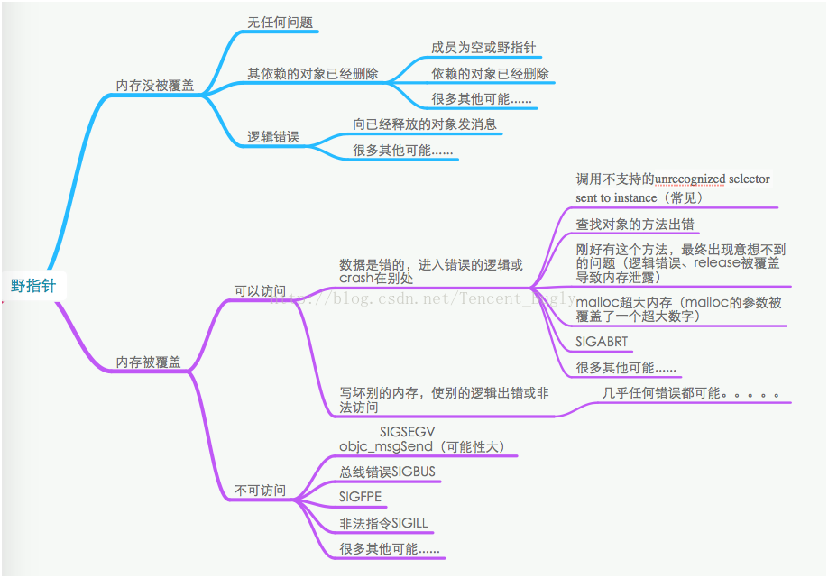
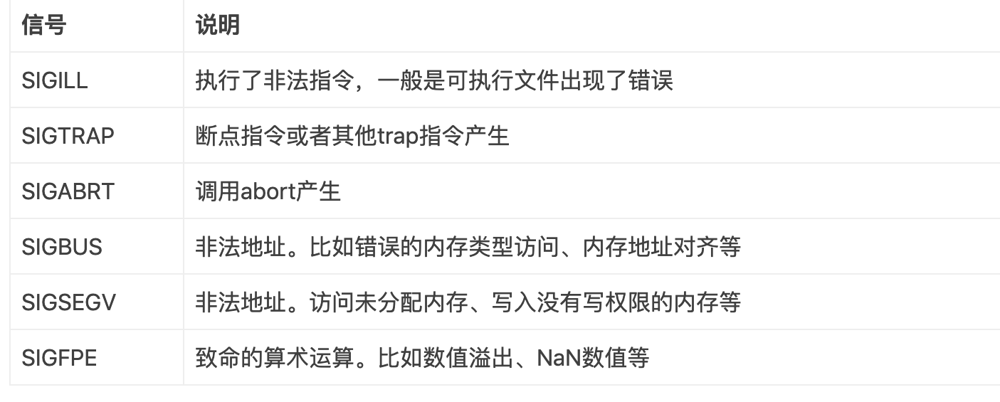

#野指针定位

## 参考文档
* [iOS 野指针定位：野指针嗅探器](https://www.itcodemonkey.com/article/9880.html)
* [如何定位Obj-C野指针随机Crash(一)：先提高野指针Crash率](https://blog.csdn.net/Tencent_Bugly/article/details/46277055)
* [如何定位Obj-C野指针随机Crash(二)：让非必现Crash变成必现](https://cloud.tencent.com/developer/article/1070512)
* [如何定位Obj-C野指针随机Crash(三)：加点黑科技让Crash自报家门](https://cloud.tencent.com/developer/article/1070528)
* [iOS监控-野指针定位](https://www.jianshu.com/p/4c8a68bd066c)
* [实现思路一](https://github.com/fangjinfeng/MySampleCode/tree/master/FJFZombieSnifferDemo)
* [实现思路一](https://github.com/hdu-rtt/WildPointerChecker)
* [实现思路二](https://github.com/sindrilin/LXDZombieSniffer)

## 野指针
* 定义：已删除的对象或未申请访问受限内存区域的指针
* 成因（iOS中）：dealloc(release)执行后系统并不是立马释放内存，而是标记内存为等待释放

* [常见导致野指针的情况](https://ctinusdev.github.io/2017/03/03/WriteWildPointer/)
	* unsafe_unretained
	* 在objc_setAssociatedObject方法中该用OBJC_ASSOCIATION_RETAIN_NONATOMIC修饰的对象误用成OBJC_ASSOCIATION_ASSIGN
	* CoreFoundation层对象Toll-Free Bridging到Foundation层中，已经用了__bridge_transfer关键字转移了对象的所有权之后，又对CoreFoundation层对象调用了一次CFRelease
	* NSNotification/KVO 只addObserver并没有removeObserver
	* 多线程
	* MRC（现在一般只会出现在corefoundation框架和c++代码）

## 随机性

## 野指针定位思路
* [iOS野指针定位总结](https://juejin.im/post/5c23397f6fb9a049ca376534) 介绍了常见几个xcode方案的原理
* Malloc Scribble: 填充不可访问的地址 0x55，存在问题：
	* 填入的0x55可能被分配覆盖
	* 无法定位到具体问题
* Zombie Objects: 填充填充僵尸对象，不真正释放对象，造成问题
	* 内存增大

## 方案一
1. hook free 填充 0x55
2. hook free 不真的释放内存
3. 往不释放的内存里面填充一个对象，获取相关信息

## 方案二 
* 核心思想和方案一类似，都是通过不释放对象，往对象中填充另一个对象来实现
* 实现步骤：
	1. hook 根类的dealloc方法
	2. 系统调用dealloc时利用运行时方法修改根类为指定的处理消息的类
	3. 延迟释放对象，在释放对象的时候同时将类类型修改回来，调用原先的dealloc方法

## crash 类型
* mach exception
* singal
* NSException

捕获signal的做法

	
		NSArray *machSignals = @[
		  	@(SIGABRT),
		    @(SIGBUS),
		    @(SIGFPE),
		    @(SIGILL),
		    @(SIGTRAP),
		    @(SIGSEGV)
		];
		for (int index = 0; index < machSignals.count; index ++) {
		    signal([machSignals[index] intValue], &machSignalExceptionHandler);
		}
	
捕获NSException的方法

 `
NSSetUncaughtExceptionHandler(&ocExceptionHandler);
`

## 思考
从对象在内存的存储结构来看，实例变量是保存在isa 后续的内存空间里的，上面两种方案实际上都会修改isa的指向，这样会导致无法正常访问到对象里保存的实例变量，会不会导致对象所持有的实例变量无法释放导致内存泄漏

 *  应该不会，在对象释放的时候，dealloc到free的之间会先调用objc_destructInstance释放所保存的实例变量，所以对于方案一来说，修改的是free函数，对象的实例变量应该在之前被释放，对于方案二来说，修改的是dealloc方法，在延时时间到了调用原先方法的时候会重新把类修改回去，这样保证了能正常方案之前的实例变量，保证后续释放过程的正常。
 *  由此来看，方案二存在无法获取到野指针访问的情景，例如如果保存了对象的实例变量的指针，然后之间通过这个指针去访问，对象的实例变量没有被释放，所以没有被hookdealloc方法，这种方式的野指针无法被这种方式定位到

## 延展阅读
 * [OC类与对象的内存分配以及成员变量的访问原理](http://www.th7.cn/Program/IOS/201709/1257668.shtml)
 * [Objective-C类成员变量深度剖析--oc对象内存模型](https://www.cnblogs.com/feng9exe/p/9186920.html)
 * [iOS崩溃crash大解析](https://www.jianshu.com/p/1b804426d212)
 * [漫谈 iOS Crash 收集框架](https://www.jianshu.com/p/8dbf3b598f46)
 * [大白健康系统--iOS APP运行时Crash自动修复系统](https://neyoufan.github.io/2017/01/13/ios/BayMax_HTSafetyGuard/)
 * [对应防护系统](https://github.com/Wuou/WOCrashProtector)
 * [iOS的崩溃捕获方案](http://silentcat.top/2017/11/23/iOS%E7%9A%84%E5%B4%A9%E6%BA%83%E6%8D%95%E8%8E%B7%E6%96%B9%E6%A1%88/)
 * [iOS Mach异常和signal信号](https://www.jianshu.com/p/133fd6f20563)

#### 根据上面的文章，结合之间的实现细节写了一个野指针防护的示例
[code](https://github.com/cgx2012/CGXWildPointerCrashAdvoid)

原理：
 
 * 采取方案一，通过不释放对象达到野指针防护的实现，利用消息转发把发送给zombie对象的方法发给空或者日志搜集系统
 * 对于小于zombie objc的对象要达到防护的只能不处理，但是这会导致这部分错误连日志都收集不到
 * 所以现在的代码中还是把小于zombie的对象塞了0x55

